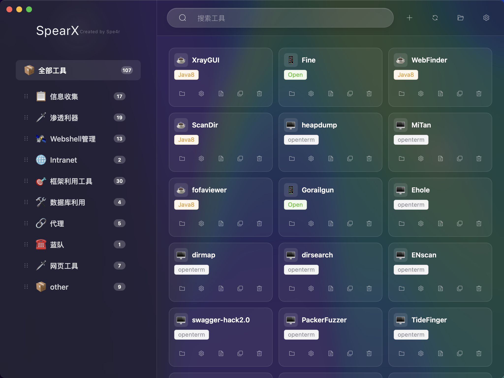
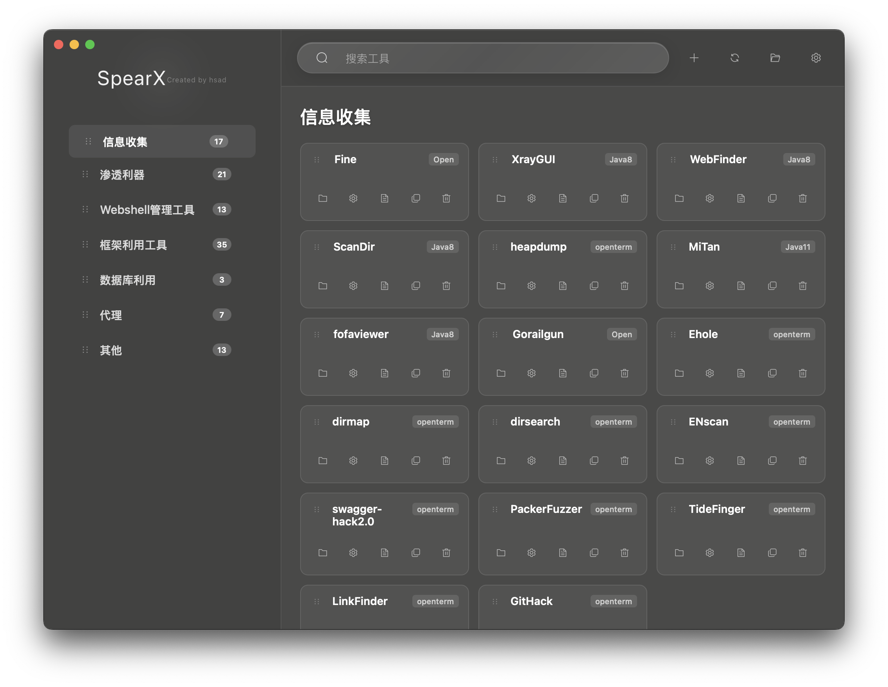

# SpearX - 现代化跨平台工具管理器

**基于原项目进行 UI 重构和体验优化的现代化工具管理器**

---

## 🔄 相比原项目的改进

### 🎨 UI/UX 重新设计

- **🌟 简约化界面设计**
  - 移除所有工具和分类的 emoji 图标，采用纯文字设计
  - 工具类型标签移至卡片右上角，布局更清晰
  - 卡片尺寸优化，信息密度更合理

- **⚡ 交互体验优化**
  - 移除"全部工具"分类，启动时自动选择第一个分类
  - 新增工具描述 tooltip，鼠标悬停显示详细信息
  - 侧边栏和工具卡片尺寸调整，视觉更舒适

- **🗂️ 拖拽排序功能**
  - 支持分类的拖拽重新排序
  - 支持工具的拖拽重新排序
  - 添加拖拽手柄和视觉反馈

### 📊 对比展示

**原版本 vs 新版本 界面对比:**

---

## 🙏 致谢

本项目基于 [sspsec/Spear](https://github.com/sspsec/Spear) 进行二次开发和优化。

感谢原作者 **sspsec** 创建了这个优秀的工具管理器项目，为开发者和安全研究人员提供了强大的工具管理解决方案。本项目在原有功能基础上专注于 UI/UX 的改进和优化。

**⭐ 如果这个项目对你有帮助，请给个 Star ⭐**

